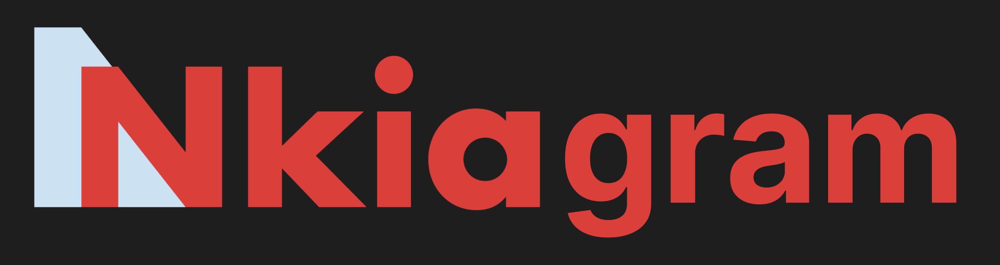

# Nkiagram



Nkigram is a social networking service (SNS) designed for internal use within Nkia, featuring an interface and user experience similar to that of Instagram. This platform allows employees of Nkia to connect, share, and engage in a familiar social media environment tailored specifically to the company’s internal culture and communication needs.

### Feature

• **Familiar UI**: Nkigram offers a user interface that closely resembles Instagram, ensuring that users feel comfortable and can easily navigate the platform.
• **Internal Networking**: The platform is designed to foster communication and collaboration among Nkia employees, allowing them to share updates, photos, and connect with colleagues.
• **Content Sharing**: Users can post images, like, and comment on posts, much like they would on a typical social media platform.
• **Privacy and Security**: Since Nkigram is built for internal use, it incorporates enhanced privacy and security measures to protect company data and employee interactions.

### Technology Stack

• **Frontend**: Built with Next.js and Tailwind CSS for a responsive and dynamic user interface.
• **Backend**: Powered by Firebase, providing robust data management and real-time updates.
• **Authentication**: Integrated with NextAuth for secure user authentication within the company.
• **State Management**: Utilizes Recoil for efficient state management across the application.

### Getting Started

First, run the development server:

```bash
npm run dev
# or
yarn dev
# or
pnpm dev
# or
bun dev
```

Open [http://localhost:3000](http://localhost:3000) with your browser to see the result.

### Contribution

We welcome contributions from Nkia employees! If you have suggestions for new features or have found a bug, please submit an issue or a pull request.

### Contact

For more information or support, please contact this email:
skyxxx9339@naver.com

### Contributors

<a href="https://github.com/jukangpark/nkiagram/graphs/contributors">
  
</a>
